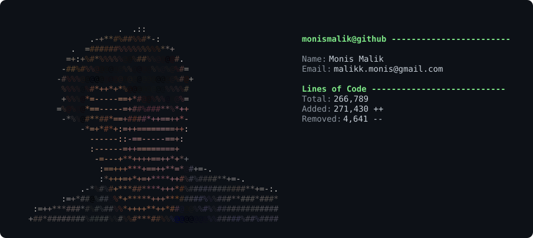

# Hi, I'm Monis Malik

**AI / GenAI Engineer · Dubai, UAE** — I build LLM agents and explainable decision systems for real businesses, and I implement the research papers behind them from scratch.

**Open to AI / GenAI Engineer roles — UAE or remote.**

---

## Featured

| Project | Why it's worth a look |
|---|---|
| **[data-refinery](https://github.com/MONISMALIK1/data-refinery)** | LangGraph pipeline that turns messy mixed-format files into governed, PII-safe, AI-ready datasets — DuckDB warehouse, lineage, quarantine. **34 offline tests + CI, MIT-licensed.** |
| **[agentic-support-desk](https://github.com/MONISMALIK1/agentic-support-desk)** | Bilingual (Arabic/English) support-ticket triage split across four scoped agents — language, classification, response, escalation — each with a visible reasoning trace, so a support lead can see *why* a ticket was auto-answered or escalated. **Zero-dependency: Python stdlib only, MIT-licensed.** |
| **[quant-agent](https://github.com/MONISMALIK1/quant-agent)** | Adaptive, self-supervising paper-trading crypto system with a 9-layer risk pipeline. **81 tests + walk-forward backtest** — and honest in the README about what isn't yet statistically significant. |
| **[langgraph-fraud-detection](https://github.com/MONISMALIK1/langgraph-fraud-detection)** | Tiered fraud-detection agent: rule engine, anomaly scoring, and a Claude analyst for gray-zone transactions. |
| **[axxion-aios-orchestrator](https://github.com/MONISMALIK1/axxion-aios-orchestrator)** | Reference implementation of an agentic claims operating system — scoped agents, grounded verification, risk-tiered human gate, hash-chained audit trail. |

---

## Recent work (private)

These are private while in active client conversations — happy to walk through the code or share access. Email **malikk.monis@gmail.com** for details.

- **rasid** — UAE Emiratisation quota tracker: reads an HR roster export, computes every expiring date/amount in plain Python, and holds any drafted message that states a figure it wasn't given.
- **majlis** — Bilingual (Arabic/English/Arabizi) support triage for UAE queues — redacts personal data before any model call and never auto-answers a regulator escalation.
- **vouch** — Answers security questionnaires from what you can actually prove — adversarial drafting with a deterministic guard against over-claiming.

---

## AI prototypes for real UAE companies

I research a company's real, evidenced problem — then build a working prototype slice of the solution:

| Project | What it does |
|---|---|
| [careem-support-resolver](https://github.com/MONISMALIK1/careem-support-resolver) | AI agent that resolves Careem's #1 customer complaint (failed support) in seconds — grounded in policy + order facts, with safety guardrails. Backed by [analysis of 400 real reviews](https://github.com/MONISMALIK1/careem-feedback-analysis) |
| [tabby-settlement-reconciler](https://github.com/MONISMALIK1/tabby-settlement-reconciler) | Diffs a merchant ledger against Tabby's BNPL settlement report — catches missing payouts and fee discrepancies, ranked by money at risk |
| [klaim-denial-shield](https://github.com/MONISMALIK1/klaim-denial-shield) | Explainable pre-submission claim denial-risk scorer + grounded appeal agent for UAE health insurance (DHA/DOH rejection codes) |
| [alaan-expense-agent](https://github.com/MONISMALIK1/alaan-expense-agent) | Explainable, FTA-defensible expense auto-decision engine |
| [mamo-fairhold](https://github.com/MONISMALIK1/mamo-fairhold) | Stress-tested rolling-reserve & hold engine for a payment facilitator |
| [ziina-fairhold](https://github.com/MONISMALIK1/ziina-fairhold) | Bounded, dated holds instead of full-account freezes for a licensed UAE payment company — holds the computed exposure, not 32x the dispute |
| [keyper-tenant-risk](https://github.com/MONISMALIK1/keyper-tenant-risk) | Explainable tenant default-risk underwriting for rent-now-pay-later |
| [lune-transaction-enricher](https://github.com/MONISMALIK1/lune-transaction-enricher) | Turns messy bank descriptors into structured merchant + category data |
| [axxion-repair-audit](https://github.com/MONISMALIK1/axxion-repair-audit) | Explainable pre-payout repair-estimate leakage scorer for UAE motor claims |
| [axxion-aios-orchestrator](https://github.com/MONISMALIK1/axxion-aios-orchestrator) | Runnable reference implementation of an agentic claims operating system — intake, routing, scoped agents, grounded verification, risk-tiered human gate, hash-chained audit trail |
| [uae-startup-solutions](https://github.com/MONISMALIK1/uae-startup-solutions) | Ten researched problems across UAE startups (Stake, Huspy, Bayzat, Sarwa, Mal, and more) each solved with a compact explainable engine — CBUAE mortgage pre-underwriting, AAOIFI Shariah screening, grounded claims agents |
| [property-finder-trust-score](https://github.com/MONISMALIK1/property-finder-trust-score) | Explainable Listing Trust Score for Dubai real estate — perceptual-hash duplicate detection, bait-price outlier tests, CLIP photo-description mismatch; ships as CLI, API, and dashboard |

> Note: these are independent, unaffiliated concept prototypes — not official products of the companies named, and built only on public information.

## AI safety and governance layers

[ai-employee-guard](https://github.com/MONISMALIK1/ai-employee-guard) — a safety layer for AI agents given real authority: only asserts facts on record, only executes allowlisted actions, and hands off to a human when nothing on file resolves the request. Full audit trail. · [shariah-guard](https://github.com/MONISMALIK1/shariah-guard) — a compliance layer for AI-native financial products: grounds every Shariah-relevant AI output and escalates to a human board instead of improvising

## Production agent pipelines (LangGraph)

[langgraph-fraud-detection](https://github.com/MONISMALIK1/langgraph-fraud-detection) — tiered fraud-detection agent: rule engine, anomaly scoring, and a Claude analyst for gray-zone transactions · [data-refinery](https://github.com/MONISMALIK1/data-refinery) — turns messy mixed-format files into governed, PII-safe, AI-ready datasets, with a DuckDB warehouse, local vector index, quarantine, and lineage

## Research papers, implemented from scratch (zero dependencies)

**RAG:** [rag](https://github.com/MONISMALIK1/rag) (Lewis et al., 2020) · [self_rag](https://github.com/MONISMALIK1/self_rag) · [corrective_rag](https://github.com/MONISMALIK1/corrective_rag) · [hyde](https://github.com/MONISMALIK1/hyde) — also [rag-langchain-demo](https://github.com/MONISMALIK1/rag-langchain-demo), the same pattern built on LangChain + Claude

**Agents & reasoning:** [react_agent](https://github.com/MONISMALIK1/react_agent) · [reflexion](https://github.com/MONISMALIK1/reflexion) · [rewoo](https://github.com/MONISMALIK1/rewoo) · [pal](https://github.com/MONISMALIK1/pal) · [self_consistency](https://github.com/MONISMALIK1/self_consistency) · [chain_of_verification](https://github.com/MONISMALIK1/chain_of_verification) · [mixture_of_agents](https://github.com/MONISMALIK1/mixture_of_agents) · [dev_team](https://github.com/MONISMALIK1/dev_team) (multi-agent SWE team)

**Algorithms:** [hyperloglog](https://github.com/MONISMALIK1/hyperloglog) (Flajolet et al., 2007) · [minhash_lsh](https://github.com/MONISMALIK1/minhash_lsh) (MinHash + LSH banding)

## Developer tools for LLM systems

[prompt-guard](https://github.com/MONISMALIK1/prompt-guard) — prompt-injection detection · [agent-watchdog](https://github.com/MONISMALIK1/agent-watchdog) — loop detector + cost kill switch for agents · [prompt-sentinel](https://github.com/MONISMALIK1/prompt-sentinel) — git-native prompt regression testing · [migration-guard](https://github.com/MONISMALIK1/migration-guard) · [stripe-reconciler](https://github.com/MONISMALIK1/stripe-reconciler) · [api-breakcheck](https://github.com/MONISMALIK1/api-breakcheck) · [env-sentinel](https://github.com/MONISMALIK1/env-sentinel)

## Low-resource NLP

[Kashmiri-tts-model](https://github.com/MONISMALIK1/Kashmiri-tts-model) — text-to-speech for Kashmiri, a low-resource language

---

---
